  

  <em>Building lightweight tools, modding hardware, and blogging since 2014 at <a href="https://x-item.com">x-item.com</a>.</em>

 

### 👨‍💻 关于我 | About Me

- 🚀 **当前主力开发：** **Appstract** - 一个 Go 编写的便携软件启动与管理工具。
- 🛠️ **效率工具：** **chrome-go** - 快速部署带有 Chrome++ 增强功能的纯净便携版 Chrome 环境。
- ⚙️ **硬核折腾：** 将小米 5 爆改直供电、自制散热并编译驱动，打造 Headless Linux 服务器。
- 🎮 **工作之外：** 开放世界与类魂游戏玩家，研究动漫产业模式。

---

### 📊 GitHub 全景数据 | Metrics

  

---

### 📦 核心项目 | Pinned Projects

  
  
  
  

